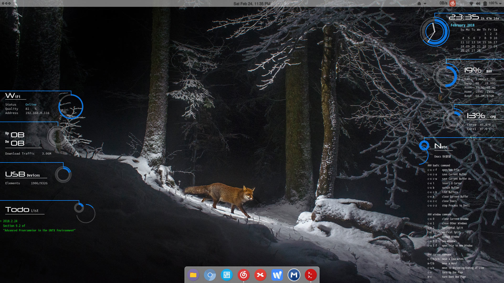

ConkyBallonPlus
---

Conky script based on [Ballon Conky](https://iacoporosso.deviantart.com/art/Ballon-Conky-242334528)



### How to use

``` shell
$ conky -c left & conky -c right &
$ # or
$ conky -c left_simp & conky -c right_simp &
```

Or active it by Conky Manager.

You can add alias in your shell config file like `.zshrc`:
``` shell
alias note='vim ~/.conky/ConkyBallonPlus/text/note.txt'
alias todo='vim ~/.conky/ConkyBallonPlus/test/todo.txt'
```
So that you can edit your note & todo list text file easily.

Note that this script is not always suited to your system, modify it if necessary.
And don't forget to copy fonts to your system/user/conky fonts directory, the path may be `/usr/share/fonts`, `~/.fonts` or `~/.conky/fonts`
